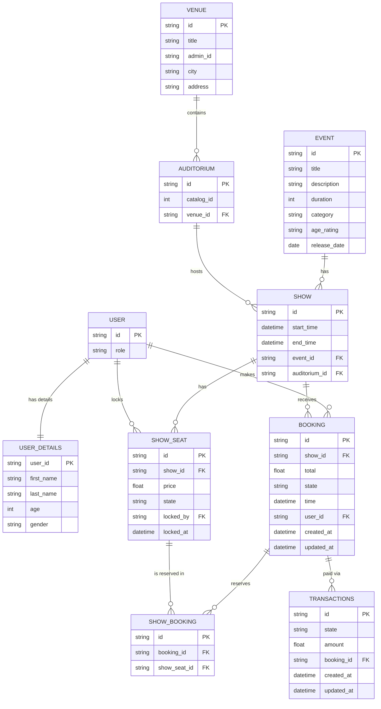

### BookMySeat Entity Relationship Diagram (ERD)

Generated using Google Gemini Agent Using [DB Schema Diagram](./db-schema-diagram.png)

```mermaid
erDiagram
    EVENT {
        string id PK
        string title
        string description
        int duration
        string category
        string age_rating
        date release_date
    }

    SHOW {
        string id PK
        datetime start_time
        datetime end_time
        string event_id FK
        string auditorium_id FK
    }

    VENUE {
        string id PK
        string title
        string admin_id
        string city
        string address
    }

    AUDITORIUM {
        string id PK
        int catalog_id
        string venue_id FK
    }

    USER {
        string id PK
        string role
    }

    USER_DETAILS {
        string user_id PK
        string first_name
        string last_name
        int age
        string gender
    }

    SHOW_SEAT {
        string id PK
        string show_id FK
        float price
        string state
        string locked_by FK
        datetime locked_at
    }

    BOOKING {
        string id PK
        string show_id FK
        float total
        string state
        datetime time
        string user_id FK
        datetime created_at
        datetime updated_at
    }

    SHOW_BOOKING {
        string id PK
        string booking_id FK
        string show_seat_id FK
    }

    TRANSACTIONS {
        string id PK
        string state
        float amount
        string booking_id FK
        datetime created_at
        datetime updated_at
    }

    EVENT ||--o{ SHOW : "has"
    VENUE ||--o{ AUDITORIUM : "contains"
    AUDITORIUM ||--o{ SHOW : "hosts"
    USER ||--|| USER_DETAILS : "has details"
    USER ||--o{ BOOKING : "makes"
    SHOW ||--o{ BOOKING : "receives"
    SHOW ||--o{ SHOW_SEAT : "has"
    BOOKING ||--o{ SHOW_BOOKING : "reserves"
    SHOW_SEAT ||--o{ SHOW_BOOKING : "is reserved in"
    BOOKING ||--o{ TRANSACTIONS : "paid via"
    USER ||--o{ SHOW_SEAT : "locks"
```