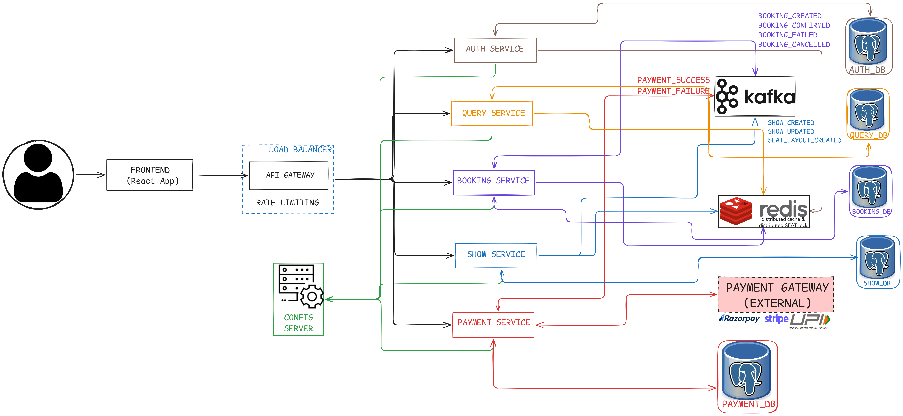
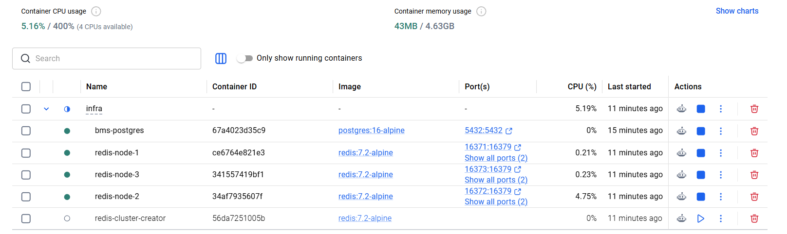

# 🎟️ BookMySeat - Scalable Ticket Booking Platform

A full-stack distributed system inspired by modern ticket booking platforms like BookMyShow.  
This project focuses on solving real-world backend challenges such as concurrency, distributed transactions, and high-scale system design.

---

## Objective

The goal is to go beyond a simple clone and build a **production-grade system** while learning:

- Distributed Systems Architecture
- Concurrency Control & Race Conditions
- Distributed Locking (Seat Booking Problem)
- Idempotent APIs (Safe Payments & Bookings)
- Event-Driven Architecture (Kafka)
- High Availability & Fault Tolerance

It also strengthens:
- Spring Boot Microservices
- Database Design
- Frontend Development with React

---

## Architecture



---

## Tech Stack


### Infrastructure
- Docker (PostgreSQL, Redis, Kafka)

### AI Assistants
- **Google Gemini** Agent (IntelliJ Idea Plugin)
- ChatGPT

### Frontend
- ReactJS

### Backend
- **Language:** Java 17
- **Framework:** Spring Boot (Microservices)
- **Build Tool:** Maven

### Data & Storage
- **Database:** PostgreSQL
- **Cache:** Redis (locking + caching)

### Messaging
- **Apache Kafka** for:
    - Booking events
    - Payment processing
    - Notifications

---

## 📂 Project Structure & Design

```
BookMySeat/
├── backend/
│   ├── api-gateway/
│   ├── auth-service/
│   ├── booking-service/
│   ├── config-server/
│   ├── payment-service/
│   ├── query-service/
│   └── show-service/
├── docs/
│   ├── img/
│   ├── lld/
│   ├── 1-requirement-gathering.md
│   ├── 2-actors.md
│   ├── 3-architecture-diagram.excalidraw
│   ├── 3-architecture-diagram.png
│   └── api-design.md
├── frontend/
│   └── readme.md
├── infra/
│   ├── .env.template
│   ├── kafka-docker-compose.yaml
│   ├── postgres-docker-compose.yaml
│   ├── redis-docker-compose.yaml
│   └── schema.sql
├── .gitignore
├── infra-setup-docker.sh
└── readme.md
```

Detailed documentation including:
- HLD (High-Level Design)
- LLD (Low-Level Design)
- Database Schema
- API Contracts

Available in the [`/docs`](./docs) directory

---

## Getting Started

### Infrastructure Setup

A helper script is provided to easily manage the entire infrastructure (PostgreSQL, Redis, Kafka) at once.

To manage the infrastructure, execute the following script from the root directory:

```bash
# To set up and start the infrastructure for the first time
./infra-setup-docker.sh setup

# To start the infrastructure containers subsequently
./infra-setup-docker.sh start

# To stop the infrastructure containers
./infra-setup-docker.sh stop

# To remove all containers and volumes
./infra-setup-docker.sh cleanup
```



---